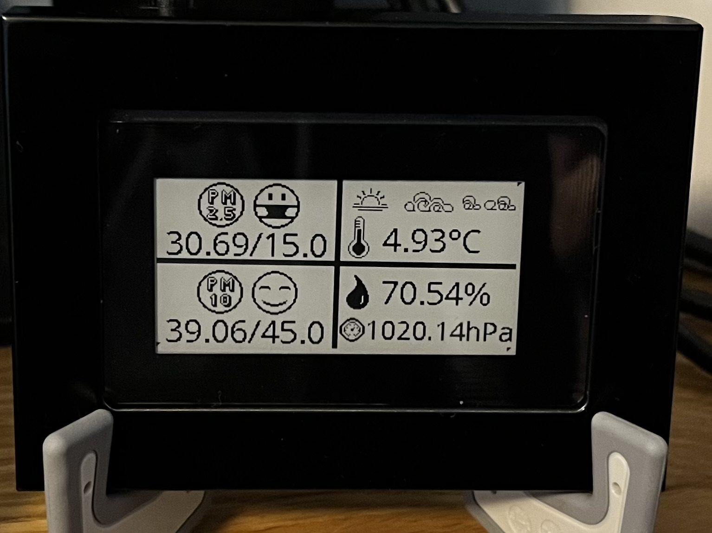

# Weather Conditions Display with Waveshare 2,13inch e-Paper HAT screen for Raspberry Pi Zero 2 W



This Python script fetches weather conditions from specified sources and displays them on a Waveshare 2.13inch Touch e-Paper HAT screen along with additional images. It supports fetching data from Airly, and AQICN APIs. This have been tested on Raspberry Pi Zero 2 W.

## Prerequisites

```
Python 3.x installed on your system
Waveshare 2.13inch Touch e-Paper HAT screen
Environment variables set up for API tokens (AQICN_TOKEN and AIRLY_TOKEN)
requests, pandas, dotenv, and PIL Python packages installed
Geographic locations and station IDs defined in a JSON file (default: data.json)
```

## Installation

Clone this repository or download the script.
Install required Python packages using pip3 install -r requirements.txt.
Set AIRLY_TOKEN environment variable
Usage

```
python3 weather_display.py [--datafile DATAFILE] [--rotate] [--city CITY] [--location LOCATION]
--datafile: Path to the JSON file containing geographic locations and station IDs. Default is data.json.
--rotate: Rotate the image by 180 degrees (optional).
--city: Specify the city for weather conditions.
--location: Specify the location ID for the chosen station.
--source: Chose source for weather data, available choices are: airly
```

## Example

```
python weather_display.py --rotate --city warsaw --location warsaw_station
```

This command will display weather conditions for Warsaw, Poland, using the station with ID warsaw_station and rotate the output image.

For usage run:

```
python weather_display.py --help
```

## Adding sources

```
- Add required API token to e.g. `.env`
- Add source to `--source` argparse argument
- Add your source to `get_weather_conditions()` function
- Update path to token under `if __name__ ...` block
- Add source to `if args.source ...` statement block
- Add `geographic_locations` and `stations` to `data.json` file
```

## Notes

Make sure to set up the required environment variables for API tokens.
Ensure the specified city and location ID are available in the provided data file.
Airly API documentation can be found here: https://developer.airly.org/en/docs. Register to grab API TOKEN.
Module `waveshare_epd` origin can be found here: https://github.com/waveshare/Touch_e-Paper_HAT.
Display manual can be found here: https://www.waveshare.com/wiki/2.13inch_Touch_e-Paper_HAT_Manual#Download_the_Demo

## Author

This script was created by Piotr Boruszczak.
